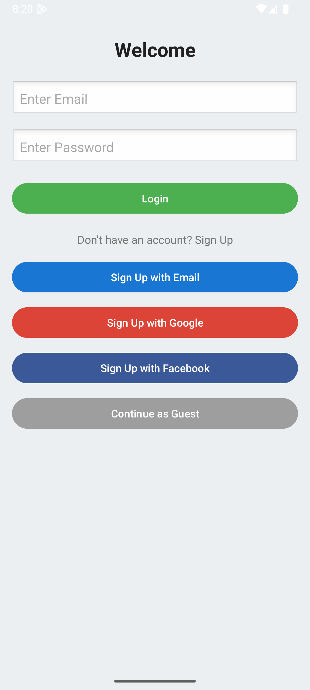
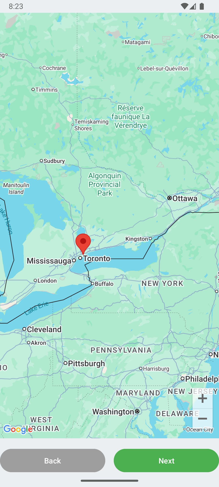
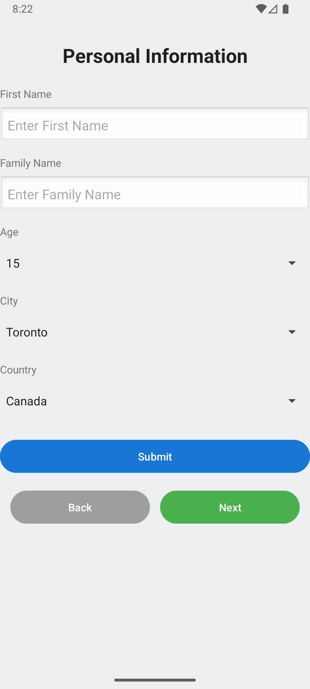

# Simple Login App

**A simple Android app demonstrating Firebase Authentication, video recording, and map integration.**

## 📌 Overview

**Simple Login App** is a final project for my Android development class. It showcases:
- **Firebase Authentication** (Email/Password, Google, Facebook, Anonymous)
- **Video Recording** functionality
- **Map Integration** using Google Maps API
- **Data Storage** with Firebase Realtime Database

This app is designed to be a learning resource and a practical example of modern Android development with Firebase.

---

## 📱 Features

| Feature                | Description                                                                 |
|------------------------|-----------------------------------------------------------------------------|
| **Firebase Auth**      | Login with Email/Password, Google, Facebook, and Anonymous                 |
| **Video Recording**    | Record and save videos within the app                                       |
| **Map Integration**    | View and interact with maps using Google Maps API                           |
| **Data Storage**       | Store user data and video metadata in Firebase Realtime Database            |

---

## 🛠️ Tech Stack

- **Android Studio** (Kotlin/Java)
- **Firebase Authentication**
- **Firebase Realtime Database**
- **Google Maps SDK**
- **Facebook SDK** (for Facebook login)
- **CameraX** (for video recording)

---

## 📂 Project Structure

```
Simple_Login_App/
├── app/
│   ├── src/
│   │   ├── main/
│   │   │   ├── java/com/example/simpleloginapp/  # Main app code
│   │   │   ├── res/                             # Resources (layouts, drawables, etc.)
│   │   │   └── AndroidManifest.xml
│   ├── build.gradle
│   └── ...
├── README.md
└── LICENSE
```

---

## 🚀 Getting Started

### Prerequisites

- Android Studio (latest version)
- Firebase project (with Authentication and Realtime Database enabled)
- Google Maps API key
- Facebook Developer account (for Facebook login)

### Installation

1. **Clone the repository:**
   ```bash
   git clone https://github.com/Prabesh2061/Simple_Login_App.git
   ```

2. **Open in Android Studio:**
   - File > Open > Select the project folder

3. **Set up Firebase:**
   - Create a Firebase project at [Firebase Console](https://console.firebase.google.com/)
   - Add your app to Firebase and download the `google-services.json` file
   - Place `google-services.json` in the `app/` directory

4. **Add API Keys:**
   - Add your Google Maps API key in `AndroidManifest.xml`
   - Add your Facebook App ID in `strings.xml`

5. **Build and Run:**
   - Sync Gradle and run the app on an emulator or physical device

---

## 🔧 Configuration

### Firebase Setup

1. Enable **Email/Password**, **Google**, and **Facebook** authentication in Firebase Console.
2. Add your SHA-1 fingerprint in Firebase project settings.
3. Enable **Realtime Database** and set rules for testing:
   ```json
   {
     "rules": {
       ".read": "auth != null",
       ".write": "auth != null"
     }
   }
   ```

### Google Maps API

1. Get an API key from [Google Cloud Console](https://console.cloud.google.com/).
2. Add the key to `AndroidManifest.xml`:
   ```xml
   <meta-data
       android\:name="com.google.android.geo.API_KEY"
       android\:value="YOUR_API_KEY" />
   ```

### Facebook Login

1. Create a Facebook App at [Facebook for Developers](https://developers.facebook.com/).
2. Add your app’s package name and default activity class name.
3. Add the App ID to `strings.xml`:
   ```xml
   <string name="facebook_app_id">YOUR_APP_ID</string>
   ```

---

## 📸 Screenshots

| Login Screen         | Map View            | Information View     |
|----------------------|---------------------|---------------------|
|  |  |  |


---

## 📝 License

This project is licensed under the **MIT License** – see the [LICENSE](LICENSE) file for details.

---

## 🙌 Acknowledgments

- Firebase documentation
- Google Maps SDK guides
- Android Developer documentation

---

## 📫 Contact

For questions or feedback, please open an issue or contact me at [your email or GitHub profile].

---

# Documentation

## 1. Authentication Flow

- **Email/Password:** Standard Firebase email/password auth.
- **Google Login:** Uses Firebase Google Sign-In.
- **Facebook Login:** Uses Facebook SDK and Firebase.
- **Anonymous Login:** Allows temporary access without credentials.

## 2. Video Recording

- Uses **CameraX** for video capture.
- Videos are saved to device storage and metadata is stored in Firebase.

## 3. Map Integration

- Displays user location and allows basic map interactions.
- Requires location permissions.

## 4. Data Storage

- User profiles and video metadata are stored in Firebase Realtime Database.

---

## 🔍 Troubleshooting

- **Firebase issues:** Ensure `google-services.json` is correctly placed and SHA-1 is added.
- **Map not loading:** Check API key and internet permission.
- **Facebook login errors:** Verify App ID and key hashes.

---

## 📅 Future Improvements

- Add user profile management
- Implement video sharing
- Enhance map features (markers, directions)

---

**Thank you for checking out my project!** Let me know if you have any questions or suggestions. 😊


